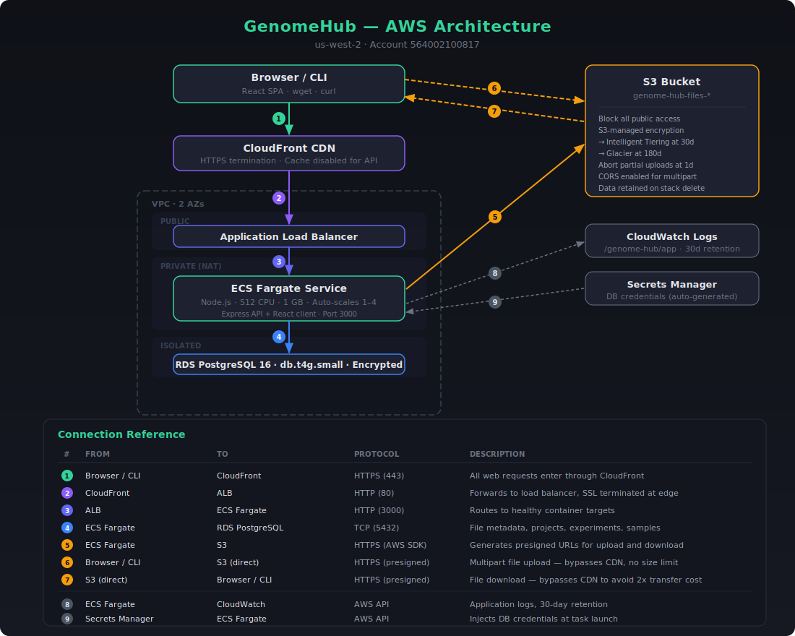
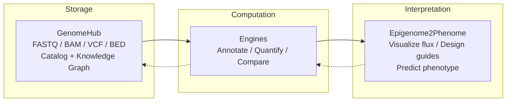

<p align="center">
  
  
  
  
</p>

# GenomeHub

Cloud-native genomic data management. Upload, catalog, and retrieve large sequencing files through a web UI. Files stream directly to S3 via presigned multipart URLs and never touch the application server.

GenomeHub is the data layer in a broader ecosystem for computational genomics:

| Project | Role |
|---|---|
| **GenomeHub** | Store and organize sequencing files (FASTQ, BAM, VCF, ...) |
| [SeqChain](https://github.com/ryandward/SeqChain) | Composable analysis toolkit for CRISPR design, Tn-seq, chromatin annotation |
| [Epigenome2Phenome](https://github.com/ryandward/ATACFlux) | Interactive visualization linking epigenomic state to metabolic flux |

---

## Architecture



The browser uploads directly to S3 via presigned multipart URLs. The server only coordinates metadata, so a 50 GB BAM file never touches the application server.

### Components

| Layer | Stack | Notes |
|---|---|---|
| Client | React 19, Vite, DuckDB WASM, Tailwind CSS 4 | SPA with progressive Parquet queries, file browser, upload |
| Server | Express, TypeORM, DuckDB Node, AWS SDK v3 | REST API, JSON→Parquet conversion, presigned URLs |
| Infra | AWS CDK (TypeScript) | Single `cdk deploy` provisions everything |
| Storage | S3 | Intelligent-Tiering at 30 days, Glacier at 180 days |
| Database | PostgreSQL 16 on RDS | Isolated subnet, encrypted at rest, 7-day backups |
| CDN | CloudFront | HTTPS termination; large downloads bypass via presigned S3 URLs |
| Auth | Google OAuth | Session tokens stored in the users table |

### Data model

All relationships are stored in a single `entity_edges` table that forms a knowledge graph. A file can belong to a collection, link to an organism, derive from another file, or reference an external URL. Adding a new relationship type never requires a schema change.

| Entity | Purpose |
|---|---|
| GenomicFile | Filename, S3 key, size, format, type tags, MD5, upload status |
| Collection | Named file groupings with type tags, technique and organism associations |
| Organism | Genus, species, strain (unique constraint), NCBI taxonomy ID |
| Technique | Sequencing assay types, seeded on boot (ChIP-seq, RNA-seq, ATAC-seq, ...) |
| Engine | External analysis services registered by URL, polled for health |
| FileType | User-managed file classification labels |
| RelationType | User-managed edge labels for provenance links |
| EntityEdge | Source, target, relation, metadata. The graph itself. |

### Engines

GenomeHub can connect to external analysis engines at runtime. An engine is any HTTP service that implements the engine contract (see [`docs/engine-methods-schema.json`](docs/engine-methods-schema.json)). Engines are stored in PostgreSQL and managed through the Settings page. Add a name and URL, and GenomeHub starts polling it immediately. No redeploy needed.

The sidebar shows a green status dot next to each reachable engine. Clicking an engine opens its method catalog, which GenomeHub renders dynamically from the schema — no hub-side configuration needed for new methods.

In production, engines typically run as sidecar containers in the same ECS Fargate task. They share the task's network namespace (reachable at `localhost`) and IAM role (automatic S3 access). The ALB only routes traffic to GenomeHub on port 3000. Engine containers are marked `essential: false`, so GenomeHub runs normally whether engines are healthy or not.

#### Engine contract

| Endpoint | Method | Description |
|---|---|---|
| `/api/health` | `GET` | Returns `{"status":"ok"}`. Polled every 30s for sidebar status. |
| `/api/methods` | `GET` | Returns the method catalog. GenomeHub renders the UI from this. |
| `/api/methods/:id` | `GET` | Single method descriptor (re-fetched before each dispatch). |
| `/api/files/upload` | `POST` | Accepts `multipart/form-data` with a `file` field. Returns `{"id":"..."}`. |
| `/api/methods/:id` | `POST` | Dispatch. Body is `{paramName: value}` JSON. Returns `200` (stream) or `202 {"job_id":"..."}`. |
| `/api/jobs/:id` | `GET` | Async only. Returns `{status, progress: {pct_complete, rate_per_sec, eta_seconds}, error}`. |
| `/api/jobs/:id/stream` | `GET` | Async only. Called once on `complete`. Body is the result file stream. |
| `/api/jobs/:id` | `DELETE` | Cancel request. Engine sets a cancellation flag; GenomeHub fire-and-forgets this. |

**Sync methods** (`async: false` or omitted) return the result stream directly in the `200` body with `Content-Disposition: attachment; filename="result.ext"`. GenomeHub pipes it to S3 with zero heap materialization.

**Async methods** (`async: true`) return `202 {"job_id":"..."}` immediately. GenomeHub polls `GET /api/jobs/:id` every 2 seconds. Progress fields drive the live UI: `pct_complete` (0.0–1.0, or `null` for indeterminate) triggers a spinner or progress bar. On `complete`, GenomeHub fetches the stream and pipes it to S3.

### Chip coloring

Metadata tags (file types, organisms, sequencing techniques) are rendered as colored chips. Each chip's color is derived deterministically from its label text using a polynomial string hash followed by a Knuth multiplicative scramble. The scramble maps small hash differences to large hue offsets, so visually similar labels like `gtf` and `gbff` get reliably distinct colors. No color palette, no database column, zero bytes of color data shipped.

---

## Quick start

### Prerequisites

- Node.js 22+
- Docker (local PostgreSQL)
- AWS CLI with configured credentials
- AWS CDK (`npm i -g aws-cdk`)

### Local development

GenomeHub supports two development modes. Neither requires AWS credentials for UI work.

#### Full-stack local mode (`npm run dev`)

Runs the Express server and Vite dev server together. Files are stored on the local filesystem instead of S3 — the full upload → Parquet conversion → DuckDB WASM preview pipeline works without AWS.

```bash
docker compose up -d          # PostgreSQL on :5432
npm install                   # Install all workspaces
cp .env.example .env          # Set DATABASE_URL, VITE_GOOGLE_CLIENT_ID, DEV_AUTH_TOKEN
npm run dev                   # Client (:5173) + Server (:3000)
```

**How it works:** The `dev:server` script sets `S3_BUCKET=` (empty), which activates local filesystem mode via `packages/server/src/lib/storage.ts`. All file I/O that would normally go through S3 goes to `data/storage/` instead. The `.env` file can keep `S3_BUCKET` set for production deploys — the inline override takes precedence.

| Concern | S3 mode (production) | Local mode (`npm run dev`) |
|---|---|---|
| File storage | S3 bucket | `data/storage/` on disk |
| Upload transport | Presigned S3 multipart URLs | `PUT /api/uploads/local-part/:fileId/:partNumber` (Vite proxy) |
| Parquet serving | CloudFront signed URL or presigned S3 URL | `GET /api/storage/:key` (Express static) |
| DuckDB conversion | `s3://bucket/key` paths + httpfs/aws extensions | Local filesystem paths, no extensions needed |
| Auth bypass | Google OAuth | `DEV_AUTH_TOKEN` / `VITE_DEV_AUTH_TOKEN` in `.env` |

**Unauthenticated routes:** Two routes are mounted before the auth guard so they work without Bearer tokens, matching the presigned-URL pattern used in production:

- `/api/uploads/local-part` — the client uploads file chunks via plain `fetch()` (no auth header), just like S3 presigned PUTs
- `/api/storage` — DuckDB WASM runs in a Web Worker that cannot attach auth headers to HTTP range requests

Both routes set `Cross-Origin-Resource-Policy: cross-origin` and CORS headers required by the Cross-Origin Isolated browser context (needed for `SharedArrayBuffer` / DuckDB WASM).

**Required `.env` values for local mode:**

| Variable | Purpose |
|---|---|
| `DATABASE_URL` | PostgreSQL connection string |
| `DEV_AUTH_TOKEN` | Server-side auth bypass token (any string) |
| `VITE_DEV_AUTH_TOKEN` | Client-side auth bypass (must match `DEV_AUTH_TOKEN`) |
| `VITE_GOOGLE_CLIENT_ID` | Google OAuth client ID (needed even locally for the login page to render) |

#### Frontend-only mode (`npm run dev:ui`)

Starts only the Vite dev server. All `/api` requests proxy to the production CloudFront distribution. Useful for iterating on UI without running the server locally.

```bash
npm run dev:ui                # Vite only, proxied to production
```

This mode uses your real Google OAuth login against production. The `VITE_DEV_AUTH_TOKEN` is explicitly cleared so the client doesn't send a dev token to the production server.

**Caution:** This connects to real data. Don't delete files or run destructive operations.

#### Connecting an engine

To connect a local analysis engine, start it separately, then go to Settings and add it with its URL (for example, SeqChain at `http://localhost:8001`). The sidebar will show a green dot when it connects.

### Deploy to AWS

```bash
cd packages/infra && npx cdk deploy
```

Builds the Docker images, pushes to ECR, and provisions:

| Resource | Spec |
|---|---|
| VPC | 2 AZs, public / private / isolated subnets, 1 NAT gateway |
| S3 | `genome-hub-files-{account}-{region}`, all public access blocked |
| RDS | `db.t4g.small`, isolated subnet, encrypted, deletion protection |
| ECS Fargate | 1 vCPU / 2 GB, auto-scales to 4 tasks at 70% CPU |
| Containers | GenomeHub (port 3000, essential) + engine sidecars (optional) |
| CloudFront | HTTPS redirect, cache disabled for API pass-through |
| ALB | Public, health-checked, routes to GenomeHub only |

---

## Project structure

```
packages/
  client/            React SPA (Vite)
    src/
      pages/         Dashboard, Files, Upload, Organisms, Collections, Settings
                     DevJsonPage — JSON → Strand analytical pipeline (dev route)
      hooks/         TanStack Query data-fetching hooks
                     useParquetPreview — DuckDB WASM Parquet preview (windowed queries, stats, filters)
                     useJsonStrand — three-phase SAB pipeline + constraint engine hook
      workers/       jsonStrandWorker — Phase 1 scan, Phase 2 stream, Phase 3 constraints
      lib/duckdb.ts  Shared DuckDB WASM singleton (boot, connection, BigInt coercion)
      ui/            CVA component recipes (Button, Badge, Card, Input, ...)
      lib/           API fetch wrapper, query keys, format detection
      components/    FilePreview, ParquetPreview (DuckDB WASM + virtualizer),
                     JsonStrandPreview (Strand SAB pipeline), DatasetErrorState,
                     Breadcrumbs, EnginePanel, ...
      stores/        Zustand stores (app state, upload progress)
  server/            Express API
    src/
      entities/      TypeORM models (GenomicFile, Collection, Organism, Engine, ...)
      routes/        Route modules (files, engines, uploads, collections, ...)
      lib/           S3 helpers (putObject, putObjectStream), edge service,
                     parquet.ts (JSON→Parquet conversion via DuckDB Node bindings)
      migrations/    Sequential SQL schema migrations
  infra/             AWS CDK stack
packages/
  strand/src/        @strand/inference — stateless schema inference (inferFields)
                     Separate from @strand/core; used only by jsonStrandWorker
vendor/
  strand/src/        Vendored @strand/core (TypeScript source, path-aliased)
                     Synced from github.com/ryandward/strand
concertina/          Vendored UI library (dist only — source at github.com/ryandward/concertina)
docs/
  engine-methods-schema.json   JSON Schema for the engine method catalog contract
```

## API reference

### Auth

| Method | Endpoint | Description |
|---|---|---|
| `POST` | `/api/auth/google` | Exchange Google OAuth token for session |
| `POST` | `/api/auth/logout` | Invalidate session |
| `GET` | `/api/auth/me` | Current user profile |

### Files

| Method | Endpoint | Description |
|---|---|---|
| `GET` | `/api/files` | List files with organism, collection, and type filters |
| `GET` | `/api/files/:id` | File detail with provenance, organisms, collections |
| `PUT` | `/api/files/:id` | Update file metadata (description, types, tags) |
| `DELETE` | `/api/files/:id` | Delete file from S3 and database |
| `GET` | `/api/files/:id/download` | Get a presigned download URL |
| `GET` | `/api/files/:id/parquet-url` | Parquet sidecar status + presigned URL |
| `GET` | `/api/files/errors` | Files with failed Parquet conversions |

### Collections

| Method | Endpoint | Description |
|---|---|---|
| `GET` | `/api/collections` | List collections with file counts |
| `POST` | `/api/collections` | Create a collection |
| `GET` | `/api/collections/:id` | Collection detail with files |
| `PUT` | `/api/collections/:id` | Update collection metadata |
| `DELETE` | `/api/collections/:id` | Delete collection |

### Multipart uploads

| Method | Endpoint | Description |
|---|---|---|
| `POST` | `/api/uploads/initiate` | Register metadata and start S3 multipart |
| `POST` | `/api/uploads/part-url` | Get presigned URL for a single part |
| `POST` | `/api/uploads/complete` | Finalize multipart, verify object, mark ready |
| `POST` | `/api/uploads/abort` | Abort failed upload, mark file as error |

### Engines

| Method | Endpoint | Description |
|---|---|---|
| `GET` | `/api/engines` | List all engines with live health status (`ok`, `error`, `unavailable`) |
| `POST` | `/api/engines` | Register an engine (`{ name, url }`) |
| `PUT` | `/api/engines/:id` | Update engine name or URL |
| `DELETE` | `/api/engines/:id` | Remove an engine |
| `GET` | `/api/engines/:id/methods` | Proxy method catalog from the engine |
| `POST` | `/api/engines/:id/methods/:methodId` | Dispatch: stream inputs to engine, pipe result to S3, create provenance edges. Returns `{ fileId, filename }` (sync) or `{ jobId }` (async). |
| `GET` | `/api/engines/jobs/:jobId` | Poll async job status and progress |
| `DELETE` | `/api/engines/jobs/:jobId` | Cancel an async job |

### Reference data

Organisms, techniques, file types, and relation types all follow the same CRUD pattern:

| Method | Pattern | Description |
|---|---|---|
| `GET` | `/api/{resource}` | List all |
| `POST` | `/api/{resource}` | Create (`{ name, description? }`) |
| `PUT` | `/api/{resource}/:id` | Update |
| `DELETE` | `/api/{resource}/:id` | Delete (blocked if referenced by edges) |

Resources: `/api/organisms`, `/api/techniques`, `/api/file-types`, `/api/relation-types`

### Other

| Method | Endpoint | Description |
|---|---|---|
| `GET` | `/api/stats` | Storage stats grouped by format |
| `POST` | `/api/edges` | Create a knowledge graph edge |
| `DELETE` | `/api/edges/:id` | Remove an edge |
| `GET` | `/api/links/:parentType/:parentId` | External links for an entity |

### Supported formats

Any text file. Format is detected from the extension (`.gz` stripped automatically). The preview endpoint reads the first 8 KB and checks for null bytes — binary files return `previewable: false`, everything else gets infinite-scroll line preview.

---

## Streaming Architecture

### Zero-buffer data pipes

GenomeHub is a pipe. Files stream S3 → engine and engine → S3 without accumulating in Node heap.

### S3 → Engine (dispatch)

When a user dispatches a genomic analysis method, the server must forward a file from S3 to the engine without buffering the entire file in RAM. The implementation in `packages/server/src/routes/engines.ts` does this via the Web Streams API:

```
S3 object (e.g. 50 GB BAM)
  │
  └─ s3.send(GetObjectCommand)
       Body.transformToWebStream()   ← Web ReadableStream, backed by HTTP response body
         │
         ▼
  new ReadableStream({
    async start(controller) {
      controller.enqueue(prelude)     ← multipart headers (~200 bytes, TextEncoder)
      for await chunk of s3Body:
        controller.enqueue(chunk)     ← S3 SDK chunk, ~16-64 KB each
      controller.enqueue(epilogue)    ← multipart boundary (~30 bytes)
      controller.close()
    }
  })
         │
         ▼
  fetch(engineUrl, {
    method: "POST",
    headers: { "Content-Type": "multipart/form-data; boundary=..." },
    body: multipartStream,
    duplex: "half",                  ← streaming request body (Node.js 18+)
  })
```

**Server heap usage: O(one S3 chunk) ≈ 16–64 KB, regardless of file size.**

No `Buffer`, no `Blob`, no `FormData`, no `Content-Length`. Chunked transfer encoding is used automatically by Node.js's `fetch` implementation when the request body is a `ReadableStream`. The engine receives a valid `multipart/form-data` POST.

### Engine → S3 (result ingestion)

```
Engine result (sync 200 body, or async GET /api/jobs/:id/stream)
  │
  └─ response.body                ← Web ReadableStream
       Readable.fromWeb(...)      ← Node.js Readable, zero-copy conversion
         │
         ▼
  @aws-sdk/lib-storage Upload     ← streaming multipart upload, auto part sizing
    Bucket: genome-hub-files-...
    Key:    files/{uuid}/{filename}
    ServerSideEncryption: AES256
         │
         ▼
  fileRepo.create({ ... })        ← GenomicFile record (format from extension)
  edges.link(result → inputs, "derived_from")
```

**Server heap usage: O(upload part size) ≈ 5–10 MB, regardless of result size.**

The result file is never materialized in Node memory. `Content-Disposition: attachment; filename="result.ext"` on the engine response determines the stored filename and format.

### DuckDB WASM + Parquet progressive query engine

Large JSON datasets (600 MB+, 955K+ records) are converted to Parquet at upload time and queried in-browser via DuckDB WASM. The browser never downloads the full file. Only the Parquet footer (a few KB) and the row groups the virtualizer needs are fetched over HTTP range requests.

```
Upload JSON
  │
  ▼  Server (fire-and-forget, non-blocking)
DuckDB Node bindings
  │  COPY (SELECT * FROM read_json_auto(tmp.json, maximum_object_size=104857600))
  │    TO tmp.parquet (FORMAT PARQUET, ROW_GROUP_SIZE 10000, COMPRESSION 'ZSTD')
  │  Upload Parquet sidecar to S3
  │  UPDATE genomic_files SET parquet_s3_key = '...', parquet_status = 'ready'
  │
  ▼  Client clicks file → polls GET /api/files/:id/parquet-url
DuckDB WASM (SharedArrayBuffer, cross-origin isolated)
  │
  ▼  Initialization (Parquet footer only — no data scan)
  │  registerFileURL('preview.parquet', presignedUrl, HTTP, true)
  │  DESCRIBE SELECT * FROM read_parquet(...)        → schema
  │  SELECT COUNT(*) FROM read_parquet(...)           → total rows (metadata)
  │  SELECT MIN(col), MAX(col) FROM read_parquet(...) → global stats (row group stats)
  │  COUNT(DISTINCT col) for cardinality detection    → filter control selection
  │
  ▼  User scrolls → virtualizer requests rows
fetchWindow(offset, limit)
  │  SELECT ... FROM read_parquet(...) WHERE ... ORDER BY ... LIMIT n OFFSET m
  │  DuckDB fetches only the row groups covering [offset, offset+limit)
  │  Response cached in Map<number, Record<string, unknown>>
  │
  ▼  User filters → predicate pushdown
applyFilters(filters, sort)
  │  SELECT COUNT(*) ... WHERE ...                → filtered count (instant)
  │  SELECT MIN/MAX ... WHERE ...                 → constrained stats
  │  DuckDB pushes predicates to Parquet row groups — skips irrelevant groups entirely
  │  Row cache cleared, cacheGen incremented
  │  VirtualRows remounted via key={cacheGen} — React reconciler destroys stale state
  │  scrollTop reset to 0 — virtualizer starts at row 0 of filtered dataset
  │
  ▼  React renders ~40 overscan rows via @tanstack/react-virtual
```

**Parquet format**: row groups of 10,000 records with ZSTD compression. Each row group carries its own min/max statistics, so DuckDB can skip entire groups that fall outside a filter range without reading them. A 600 MB JSON file compresses to ~80 MB Parquet.

**HTTP range requests**: DuckDB WASM reads Parquet files via `registerFileURL` with `DuckDBDataProtocol.HTTP`. It issues HTTP `Range` requests to fetch individual row groups on demand. The S3 CORS config exposes `Content-Range`, `Content-Length`, and `Accept-Ranges` headers. Presigned URLs rotate, so the file is always re-registered with `dropFile()` before `registerFileURL()`.

#### STRUCT column flattening

DuckDB reads nested JSON objects as `STRUCT` columns. GenomeHub flattens these into dot-notation columns matching the legacy Strand behavior:

```
Parquet schema:  pam STRUCT(pattern VARCHAR, matched BOOLEAN, pam_start INTEGER)

→ Expanded to:   pam.pattern   VARCHAR
                  pam.matched   BOOLEAN
                  pam.pam_start INTEGER

SQL:  SELECT "pam"."pattern" AS "pam.pattern",
             "pam"."matched" AS "pam.matched",
             "pam"."pam_start" AS "pam.pam_start"
      FROM read_parquet('preview.parquet')
```

Nested struct expansion is recursive-safe (tracks parenthesis depth for `STRUCT(a STRUCT(b INTEGER))`). All filter, sort, and stats queries use `colToSql()` to convert dot-notation back to struct access expressions.

#### Typed filter AST + parameterized queries

No SQL strings are concatenated from user input. The UI produces a typed filter AST (`FilterOp` discriminated union), and `compileWhere()` compiles it into parameterized SQL executed via DuckDB's `conn.prepare()`:

```
UI interaction (slider, dropdown, text input)
  │
  ▼  Component builds typed filter objects — no SQL, no escaping
  { column: "gc_content", op: { type: "between", low: 0.3, high: 0.6 } }
  { column: "strand",     op: { type: "in",      values: ["+", "-"] } }
  { column: "gene_name",  op: { type: "ilike",   pattern: "O'Brien" } }
  │
  ▼  compileWhere() — AST → parameterized SQL
  {
    clause: 'WHERE "gc_content" BETWEEN $1 AND $2
             AND "strand"::VARCHAR IN ($3, $4)
             AND "gene_name"::VARCHAR ILIKE $5',
    params: [0.3, 0.6, "+", "-", "%O'Brien%"]
  }
  │
  ▼  execQuery() — DuckDB prepared statement
  const stmt = await conn.prepare(sql);
  try { return await stmt.query(...params); }
  finally { await stmt.close(); }
```

`FilterOp` is a discriminated union with exhaustive `switch` in the compiler — adding a new filter type is a compile error until handled. `execQuery()` fast-paths to `conn.query()` when there are no parameters (metadata queries), and closes prepared statements in a `finally` block to prevent resource leaks.

#### Windowed virtualization

The virtualizer (`@tanstack/react-virtual`) renders ~40 overscan rows. `VirtualRows` fetches 200-row windows from DuckDB and caches them in a local `Map<number, Record<string, unknown>>`. Uncached rows render skeleton placeholders until the fetch resolves.

```
Scroll position → virtualizer.getVirtualItems() → [index 5000..5040]
  │
  ▼  VirtualRows useEffect
  for each uncached index:
    windowStart = floor(index / 200) * 200
    fetchWindow(windowStart, 200)    → DuckDB range request → 200 rows cached
  │
  ▼  setRows(prev => new Map([...prev, ...fetched]))
  Render: each visible row reads from the Map; missing rows show skeletons
```

#### Cache invalidation via React reconciler

When filters change, `applyFilters` clears the hook's `rowCache` ref and increments a `cacheGen` counter (React state). The `<VirtualRows>` component receives `key={cacheGen}` — when the key changes, React unmounts the old instance and mounts a fresh one in a single render pass. This declaratively destroys the stale local `rows` Map, the `fetchingRef` set, and the `useVirtualizer` instance. No `useEffect` state synchronization, no double-render waterfall.

The scroll container is reset to `scrollTop = 0` synchronously before `applyFilters` runs, so the freshly mounted virtualizer always starts at row 0 of the filtered dataset.

#### Filter sidebar

The same `FilterSidebar` pattern from the Strand pipeline is reused. Control selection is driven by column metadata:

| Column type | Cardinality | Sidebar control | Table column |
|---|---|---|---|
| Numeric | — | `RangeSlider` with constrained stats overlay | Shown with heatmap |
| Categorical | 1 | `value (constant)` label | Hidden |
| Categorical | 2–5 | `InlineSelect` toggle pills | Hidden |
| Categorical | 6–50 | `MultiSelect` popover | Shown |
| Text | > 50 | `ILIKE` text search | Shown |

Constrained stats (min/max within the current filter set) power the constraint band overlay and amber out-of-bounds indicators, identical to the Strand implementation.

#### Parquet conversion status lifecycle

```
Upload completes → parquet_status = 'converting'
  │
  ├─ Success → parquet_status = 'ready', parquet_s3_key set
  │    Client: DuckDB WASM preview
  │
  ├─ Failure → parquet_status = 'failed', parquet_error = 'OOM / parse error / ...'
  │    Client: DatasetErrorState with actionable error message
  │    Visible on: /errors page (pipeline error dashboard)
  │
  └─ Unavailable → file too large or not JSON
       Client: falls back to Strand SAB pipeline (small files) or text preview
```

#### Strand coexistence

The Strand SAB pipeline is preserved for real-time streaming use cases (live SeqChain results). The Parquet path handles large static datasets. The routing logic in `FilePreview.tsx`:

1. Poll `GET /api/files/:id/parquet-url`
2. If `ready` → `<ParquetPreview>` (DuckDB WASM)
3. If `converting` → progress indicator, poll every 2s
4. If `failed` → `<DatasetErrorState>` with error details
5. If `unavailable` → fall back to `<JsonStrandPreview>` (Strand SAB)

---

### JSON → Strand analytical pipeline

Large JSON datasets (library files, annotation tables) are analyzed in-browser through a three-phase SharedArrayBuffer pipeline. No server query, no DuckDB, no heap allocation per row.

```
JSON array (network)
  │
  ▼  Phase 1 — Worker: fetch + parse + one-pass stats
jsonStrandWorker (off-thread)
  │  Records → JSON.parse (off main thread, no GC pressure)
  │  One pass: numeric min/max, utf8_ref cardinality sets, global intern table
  │  Posts: { recordCount, internTable, numericStats, cardinality }
  │
  ▼  Phase 2 — Main thread allocates SAB; worker streams records into it
SharedArrayBuffer  ←─── StrandWriter.writeRecordBatch()
  │                        Atomics.wait() for backpressure (ring-full stall)
  │  StrandView.waitForCommit() ───► drain loop on main thread
  │  acknowledgeRead(count) after EVERY record — omitting this deadlocks
  │
  ▼  Phase 3 — Worker: vectorized constraint queries (on-demand, off-thread)
get_constraints { predicates: FilterPredicate[] }
  │  StrandView.getFilterBitset(field, predicate) — O(N) per predicate
  │  computeIntersection(bitsets)               — O(N/32), 32 records/op
  │  StrandView.getConstrainedRanges(intersection) — O(matches × numericFields)
  │  popcount(intersection)                     — O(N/32) match count
  │  Posts: { ranges: ConstrainedRanges, filteredCount }
  │
  ▼  React state: constrainedRanges, constrainedCount
FilterSidebar (UI projection)
```

**Phase 1→2 handoff**: the worker builds the global intern table (all utf8_ref distinct values, deduped, alphabetically stable). The main thread allocates the SAB, calls `initStrandHeader`, constructs a `StrandView`, and reflects the SAB + intern table back to the worker in the `stream` message.

**Phase 2 drain loop**: `view.acknowledgeRead(count)` is called unconditionally for every committed record, including records that will be filtered out. Gating it on filter results lets the ring fill and permanently deadlocks the producer — see [strand `acknowledgeRead()` docs](https://github.com/ryandward/strand).

**Phase 3 constraint queries**: fired by a debounced `useEffect` on the main thread whenever `debFilters` or multi-select state changes. The worker answers from the already-live SAB — no re-parse, no re-stream. Numeric `BETWEEN` predicates and utf8_ref `in` predicates (handles pre-resolved from the intern table) are bitset-able and go through Phase 3. Free-text `utf8` substring filters are not bitset-able and stay on the main thread via the existing zero-copy seq scan.

#### Schema inference (auto mode)

`useJsonStrand` accepts either an explicit `FieldDef[]` or the string `'auto'`. In auto mode the worker runs a Phase 0 inference pass before the stats scan:

```
Phase 0 — inferFields(records, { sampleSize: 500 })
  │  Classifies every leaf path as i32 / f64 / bool / utf8 / json
  │  Cardinality gate: distinct ≤ 100 AND ratio ≤ 0.5  →  utf8_ref (interned)
  │  Low-cardinality guarantee: distinct ≤ 8  →  always utf8_ref
  │  Pure boolean fields  →  utf8_ref  ("true" / "false" as strings)
  │  Posts: { type: 'schema', fields: FieldDef[] }
  │
  ▼  Main thread sends { type: 'scan', fields } to proceed with Phase 1
```

The low-cardinality guarantee and boolean reclassification ensure that fields like `strand` (`+`/`-`) and `is_reverse` (`true`/`false`) always receive categorical treatment regardless of sample size.

#### Cardinality-driven layout

Cardinality data collected in Phase 1 governs both the sidebar control and the table column layout. Low-cardinality categoricals carry no information row-by-row — they belong in a filter, not a column.

| Cardinality | Sidebar control | Table column |
|---|---|---|
| 1 (constant) | `value (constant)` label | Hidden |
| 2–5 | `InlineSelect` — visible toggle pills, no popover | Hidden |
| 6–100 | `MultiSelect` — popover with checkbox list | Shown |
| > 100 | Text search | Shown |

Numeric fields with `min === max` get a `value (constant)` label instead of a frozen range slider.

#### FilterSidebar — UI as projection

The sidebar renders a faithful projection of the constraint engine output. It never "thinks."

| Element | Source | Notes |
|---|---|---|
| Result counter | `constrainedCount / totalRecords` | Powered by `popcount(intersection)` — O(N/32) on the worker thread |
| Constraint band | `constrainedRanges[field].min/.max` | Faint cyan overlay on the Physical Limits track; shows where values exist given the current intersection |
| Amber Alert | `high > constrainedMax + ε` | Handle sits in empty space — no data exists there for the current filter set |
| "No results" dim | `constrainedCount === 0 && status === 'ready'` | Controls section dims to 35% opacity; "Clear all" in the header stays bright |
| Pending band | `pendingConstraints` | Constraint band dims to 10% opacity between request and worker reply |

**Three-layer false-amber defense:**

1. `hasAnyFilter` guard in `FilterSidebar` — constraint band undefined when engine is idle; `hasCon = false` → no amber possible
2. `hasCon` check in `RangeSlider` — undefined props → no amber before first worker reply
3. Dynamic epsilon `ε = (max − min) × 0.001` — 0.1% slack absorbs sub-LSB precision drift between the worker's DataView reads and the main thread's drain-loop accumulator

**Clip to Reality**: double-click the constraint band to snap both handles to the constrained bounds without auto-clipping. User intent (the explicit filter value) is preserved until the user acts.

---

### Core Stability Engine integration

The Files page virtualizes genomic file metadata using the Core Stability Engine (`concertina/core`). All data processing runs in a dedicated Web Worker; the main thread only handles DOM updates for the ~15–20 visible rows.

```
TanStack Query (main thread)
  │  GenomicFile[]
  ▼
useGenomicFileStream
  │  Converts to columnar batches via createRecordBatchStream
  │  Encodes organisms/collections as parallel list_utf8 columns
  │  (organism_ids[], organism_names[]) — no JSON.stringify
  │
  ▼  ArrayBuffer (transferred, zero-copy)
DataWorker (off-thread)
  │  Columnar storage: NumericColumn, Utf8Column, ListUtf8Column
  │  Schema integrity check: all columns must have identical row counts
  │  INGEST_ACK → main thread (one batch in flight at a time)
  │
  ▼  WINDOW_UPDATE (transferred ArrayBuffer, only visible rows)
VirtualChamber (main thread)
  │  buildAccessors(): parses window buffer once per scroll position
  │  RowProxy.get("organism_ids") → string[]   ← no JSON.parse
  │  RowProxy.get("organism_names") → string[]
  │  O(k) zip → { id, displayName }[] for ChipEditor
  │
  ▼  ~15–20 pool nodes recycled by CSS transform
```

**list_utf8 wire format** (used for `types`, `organism_ids`, `organism_names`, `collection_ids`, `collection_names`):

```
[4]                  u32    totalItems
[(rowCount+1) × 4]   Uint32 rowOffsets   row i → items[rowOffsets[i]..rowOffsets[i+1])
[(totalItems+1) × 4] Uint32 itemOffsets  item j → bytes[itemOffsets[j]..itemOffsets[j+1])
[Σ byte lengths]     Uint8  bytes        UTF-8 string data
```

`RowProxy.get()` returns `string[]` directly — the DataWorker decodes all UTF-8 before transferring the window buffer. No `JSON.parse` runs on the main thread during rendering.

**INGEST_ACK backpressure** prevents the IPC channel from being flooded: the main thread sends exactly one 500-row batch, then awaits `INGEST_ACK` from the worker before sending the next. For 1M rows (2000 batches × ~150 KB), the IPC queue depth is always 1, never 300 MB.

---

## Roadmap

### GenomeHub

- [x] In-browser analytics: JSON → Strand SAB pipeline with vectorized bitset constraint engine, zero-copy virtualizer, and reactive FilterSidebar projection
- [x] Parquet progressive queries: DuckDB WASM over HTTP range requests — schema, stats, and windowed rows from Parquet footer without downloading the full file
- [x] Pipeline error dashboard: `/errors` page with actionable error messages for failed Parquet conversions
- [ ] Search and filtering: full-text search over filenames, tags, and descriptions
- [ ] Batch operations: multi-file download (zip) and bulk tag editing
- [ ] File validation: post-upload format verification (samtools quickcheck, vcf-validator)
- [ ] Cost dashboard: real-time S3 storage cost estimates by storage tier

### Engine integration

- [x] Analysis triggers: schema-driven method UI, file picker with format filtering, dispatch
- [x] Result ingestion: engine outputs streamed to S3, cataloged with provenance edges
- [x] Async jobs: 202 dispatch path with live progress bar, ETA, rate, and cancel
- [x] Method catalog: engines declare methods via JSON schema, GenomeHub renders UI dynamically
- [ ] Preset library: save and re-apply parameter sets for common workflows

### End-to-end vision



---

## CDK commands

All CDK commands must run from `packages/infra/` (where `cdk.json` lives). Docker context paths are absolute (resolved from `import.meta.url`), so the stack synthesizes correctly regardless of working directory.

```bash
cd packages/infra
npx cdk diff       # Preview infrastructure changes
npx cdk synth      # Emit CloudFormation template
npx cdk deploy     # Build, push, and provision everything
npx cdk destroy    # Tear down (S3 and RDS are retained by policy)
```
