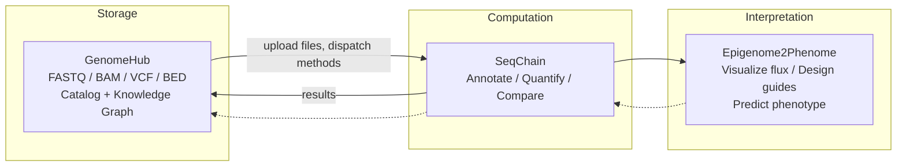

<p align="center">
  
  
  
  
</p>

# GenomeHub

Cloud-native genomic data management. Upload, catalog, and retrieve large sequencing files through a web UI. Files stream directly to S3 via presigned multipart URLs and never touch the application server.

GenomeHub is the data layer in a broader ecosystem for computational genomics:

| Project | Role |
|---|---|
| **GenomeHub** | Store and organize sequencing files (FASTQ, BAM, VCF, ...) |
| [SeqChain](https://github.com/ryandward/SeqChain) | Composable analysis toolkit for CRISPR design, Tn-seq, chromatin annotation |
| [Epigenome2Phenome](https://github.com/ryandward/ATACFlux) | Interactive visualization linking epigenomic state to metabolic flux |

---

## Architecture


The browser uploads directly to S3 via presigned multipart URLs. The server only coordinates metadata, so a 50 GB BAM file never touches the application server.

### Components

| Layer | Stack | Notes |
|---|---|---|
| Client | React 19, Vite, Tailwind CSS 4 | SPA with dashboard, file browser, upload, settings |
| Server | Express, TypeORM, AWS SDK v3 | REST API, presigned URL generation, metadata CRUD |
| Infra | AWS CDK (TypeScript) | Single `cdk deploy` provisions everything |
| Storage | S3 | Intelligent-Tiering at 30 days, Glacier at 180 days |
| Database | PostgreSQL 16 on RDS | Isolated subnet, encrypted at rest, 7-day backups |
| CDN | CloudFront | HTTPS termination; large downloads bypass via presigned S3 URLs |
| Auth | Google OAuth | Session tokens stored in the users table |

### Data model

All relationships are stored in a single `entity_edges` table that forms a knowledge graph. A file can belong to a collection, link to an organism, derive from another file, or reference an external URL. Adding a new relationship type never requires a schema change.

| Entity | Purpose |
|---|---|
| GenomicFile | Filename, S3 key, size, format, type tags, MD5, upload status |
| Collection | Named file groupings with type tags, technique and organism associations |
| Organism | Genus, species, strain (unique constraint), NCBI taxonomy ID |
| Technique | Sequencing assay types, seeded on boot (ChIP-seq, RNA-seq, ATAC-seq, ...) |
| Engine | External analysis services registered by URL, polled for health |
| FileType | User-managed file classification labels |
| RelationType | User-managed edge labels for provenance links |
| EntityEdge | Source, target, relation, metadata. The graph itself. |

### Engines

GenomeHub can connect to external analysis engines at runtime. An engine is any HTTP service that responds to `GET /api/health` with `{"status":"ok"}`. Engines are stored in PostgreSQL and managed through the Settings page. Add a name and URL, and GenomeHub starts polling it immediately. No redeploy needed.

The sidebar shows a green status dot next to each reachable engine. If no engines are configured or none are reachable, the section is hidden. The Settings page shows each engine with its live status, and you can inline-edit the name or URL.

Engines deploy independently — their own repo, their own infra, anywhere with a URL. GenomeHub proxies all data: it downloads files from S3, uploads them to the engine, fetches results, and stores them back. Engines never touch S3 or need AWS credentials. Register the URL in Settings and GenomeHub starts polling immediately.

The full engine contract is documented in [`docs/engine-interface.md`](docs/engine-interface.md). In short, an engine exposes:

| Endpoint | Purpose |
|---|---|
| `GET /api/health` | Returns `{"status":"ok"}` — GenomeHub polls this for status |
| `GET /api/methods` | Returns method schemas — GenomeHub builds UI from these |
| `POST /api/files/upload` | Accepts a file via multipart form, returns `{"id":"..."}` |
| `POST /api/methods/:id` | Executes a method, returns `{"id":"..."}` for the result |
| `GET /api/tracks/:id/data` | Returns result data as JSON |

Method parameters have two types: `file` (GenomeHub uploads a file from S3) and `string` (passed through as-is). File params can include an `accept` array to filter the file picker by format. GenomeHub doesn't know or care what the engine does with a file — that's the engine's problem.

The formal JSON Schema is at [`docs/engine-methods-schema.json`](docs/engine-methods-schema.json).

### Chip coloring

Metadata tags (file types, organisms, sequencing techniques) are rendered as colored chips. Each chip's color is derived deterministically from its label text using FNV-1a hashing with a murmur3 finalizer. The finalizer provides strong avalanche mixing so short similar strings like `gff`, `gtf`, and `gbk` land at distant hue angles. Colors are rendered in OKLCH for perceptually uniform brightness across hues. No color palette, no database column, zero bytes of color data shipped.

---

## Quick start

### Prerequisites

- Node.js 22+
- Docker (local PostgreSQL)
- AWS CLI with configured credentials
- AWS CDK (`npm i -g aws-cdk`)

### Local development

```bash
docker compose up -d          # PostgreSQL on :5432
npm install                   # Install all workspaces
cp .env.example .env          # Configure AWS credentials + bucket
npm run dev                   # Client (:5173) + Server (:3000)
```

To connect a local analysis engine, start it separately, then go to Settings and add it with its URL (for example, SeqChain at `http://localhost:8001`). The sidebar will show a green dot when it connects.

### Deploy to AWS

```bash
npx cdk deploy --region us-west-2
```

Builds the Docker images, pushes to ECR, and provisions:

| Resource | Spec |
|---|---|
| VPC | 2 AZs, public / private / isolated subnets, 1 NAT gateway |
| S3 | `genome-hub-files-{account}-{region}`, all public access blocked |
| RDS | `db.t4g.small`, isolated subnet, encrypted, deletion protection |
| ECS Fargate | 1 vCPU / 2 GB, auto-scales to 4 tasks at 70% CPU |
| Containers | GenomeHub (port 3000, built from source) |
| CloudFront | HTTPS redirect, cache disabled for API pass-through |
| ALB | Public, health-checked, routes to GenomeHub only |

---

## Project structure

```
packages/
  client/            React SPA (Vite)
    src/
      pages/         Dashboard, Files, Upload, Organisms, Collections, Settings
      hooks/         TanStack Query data-fetching hooks
      ui/            CVA component recipes (Button, Badge, Card, Input, ...)
      lib/           API fetch wrapper, query keys, format detection
      components/    FilePreview, Breadcrumbs, ConfirmDialog, ...
      stores/        Zustand stores (app state, upload progress)
  server/            Express API
    src/
      entities/      TypeORM models (GenomicFile, Collection, Organism, Engine, ...)
      routes/        Route modules (12 routers)
      lib/           S3 helpers, edge service, reference CRUD factory
      migrations/    Sequential SQL schema migrations (001-012)
  infra/             AWS CDK stack
```

## API reference

### Auth

| Method | Endpoint | Description |
|---|---|---|
| `POST` | `/api/auth/google` | Exchange Google OAuth token for session |
| `POST` | `/api/auth/logout` | Invalidate session |
| `GET` | `/api/auth/me` | Current user profile |

### Files

| Method | Endpoint | Description |
|---|---|---|
| `GET` | `/api/files` | List files with organism, collection, and type filters |
| `GET` | `/api/files/:id` | File detail with provenance, organisms, collections |
| `PUT` | `/api/files/:id` | Update file metadata (description, types, tags) |
| `DELETE` | `/api/files/:id` | Delete file from S3 and database |
| `GET` | `/api/files/:id/download` | Get a presigned download URL |

### Collections

| Method | Endpoint | Description |
|---|---|---|
| `GET` | `/api/collections` | List collections with file counts |
| `POST` | `/api/collections` | Create a collection |
| `GET` | `/api/collections/:id` | Collection detail with files |
| `PUT` | `/api/collections/:id` | Update collection metadata |
| `DELETE` | `/api/collections/:id` | Delete collection |

### Multipart uploads

| Method | Endpoint | Description |
|---|---|---|
| `POST` | `/api/uploads/initiate` | Register metadata and start S3 multipart |
| `POST` | `/api/uploads/part-url` | Get presigned URL for a single part |
| `POST` | `/api/uploads/complete` | Finalize multipart, verify object, mark ready |
| `POST` | `/api/uploads/abort` | Abort failed upload, mark file as error |

### Engines

| Method | Endpoint | Description |
|---|---|---|
| `GET` | `/api/engines` | List all engines with live health status (`ok`, `error`, `unavailable`) |
| `POST` | `/api/engines` | Register an engine (`{ name, url }`) |
| `PUT` | `/api/engines/:id` | Update engine name or URL |
| `DELETE` | `/api/engines/:id` | Remove an engine |
| `GET` | `/api/engines/:id/methods` | Proxy method schemas from engine |
| `POST` | `/api/engines/:id/methods/:methodId` | Orchestrate file upload, dispatch, and result ingestion |

### Reference data

Organisms, techniques, file types, and relation types all follow the same CRUD pattern:

| Method | Pattern | Description |
|---|---|---|
| `GET` | `/api/{resource}` | List all |
| `POST` | `/api/{resource}` | Create (`{ name, description? }`) |
| `PUT` | `/api/{resource}/:id` | Update |
| `DELETE` | `/api/{resource}/:id` | Delete (blocked if referenced by edges) |

Resources: `/api/organisms`, `/api/techniques`, `/api/file-types`, `/api/relation-types`

### Other

| Method | Endpoint | Description |
|---|---|---|
| `GET` | `/api/stats` | Storage stats grouped by format |
| `POST` | `/api/edges` | Create a knowledge graph edge |
| `DELETE` | `/api/edges/:id` | Remove an edge |
| `GET` | `/api/links/:parentType/:parentId` | External links for an entity |

### Supported formats

FASTQ, BAM, CRAM, VCF, BCF, BED, GFF/GFF3, GTF, FASTA, SAM, BigWig, BigBed, JSON. Auto-detected from file extension.

---

## Roadmap

### GenomeHub

- [ ] Search and filtering: full-text search over filenames, tags, and descriptions
- [ ] Batch operations: multi-file download (zip) and bulk tag editing
- [ ] File validation: post-upload format verification (samtools quickcheck, vcf-validator)
- [ ] Cost dashboard: real-time S3 storage cost estimates by storage tier

### Engine integration

- [x] Analysis triggers: launch engine methods from the UI with schema-driven parameter forms
- [x] Result ingestion: engine outputs cataloged back into GenomeHub with provenance edges
- [ ] Preset library: browse and apply engine presets from the GenomeHub UI

### End-to-end vision



---

## CDK commands

```bash
npx cdk diff       # Preview infrastructure changes
npx cdk synth      # Emit CloudFormation template
npx cdk destroy    # Tear down (S3 and RDS are retained by policy)
```
