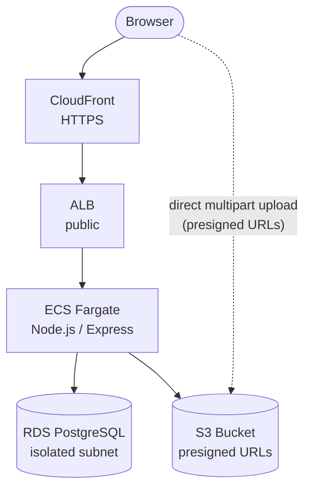
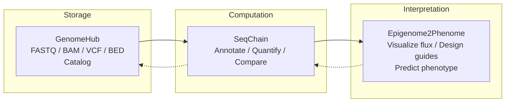

<p align="center">
  
  
  
  
</p>

# GenomeHub

Cloud-native genomic data management. Upload, catalog, and retrieve large sequencing files through a web interface — files stream directly to S3 via presigned multipart URLs; the server never buffers payloads.

GenomeHub is the **data layer** in a broader ecosystem for computational genomics:

| Project | Role |
|---|---|
| **GenomeHub** | Store and organize sequencing files (FASTQ, BAM, VCF, ...) |
| [SeqChain](https://github.com/ryandward/SeqChain) | Composable analysis toolkit — CRISPR design, Tn-seq, chromatin annotation |
| [Epigenome2Phenome](https://github.com/ryandward/ATACFlux) | Interactive visualization linking epigenomic state to metabolic flux |

---

## Architecture



**Key design choice:** the browser uploads directly to S3 via presigned multipart URLs. The server only coordinates metadata. This means a 50 GB BAM file never touches the application server.

### Components

| Layer | Stack | Notes |
|---|---|---|
| Client | React 19, Vite, Tailwind CSS 4 | SPA with dashboard, file browser, upload UI |
| Server | Express, TypeORM, AWS SDK v3 | REST API, presigned URL generation, metadata CRUD |
| Infra | AWS CDK (TypeScript) | Single `cdk deploy` provisions everything |
| Storage | S3 | Intelligent-Tiering at 30 days, Glacier at 180 days |
| Database | PostgreSQL 16 on RDS | Isolated subnet, encrypted at rest, 7-day backups |
| CDN | CloudFront | HTTPS termination; large downloads bypass via presigned S3 URLs |

---

## Quick start

### Prerequisites

- Node.js 22+
- Docker (local PostgreSQL)
- AWS CLI with configured credentials
- AWS CDK (`npm i -g aws-cdk`)

### Local development

```bash
docker compose up -d          # PostgreSQL on :5432
npm install                   # Install all workspaces
cp .env.example .env          # Configure AWS credentials + bucket
npm run dev                   # Client (:5173) + Server (:3000)
```

### Deploy to AWS

```bash
npx cdk deploy --region us-west-2
```

Builds the Docker image, pushes to ECR, and provisions:

| Resource | Spec |
|---|---|
| VPC | 2 AZs, public / private / isolated subnets, 1 NAT gateway |
| S3 | `genome-hub-files-{account}-{region}`, all public access blocked |
| RDS | `db.t4g.small`, isolated subnet, encrypted, deletion protection |
| ECS Fargate | 0.5 vCPU / 1 GB, auto-scales to 4 tasks at 70% CPU |
| CloudFront | HTTPS redirect, cache disabled for API pass-through |
| ALB | Public, health-checked |

---

## Project structure

```
packages/
  client/            React SPA (Vite)
    src/
      pages/         Dashboard, Files, Upload
      hooks/         Data-fetching hooks
      ui/            Reusable components
  server/            Express API
    src/
      entities/      TypeORM models (Project, GenomicFile)
      lib/           S3 helpers (presign, multipart)
      migrations/    SQL schema
  infra/             AWS CDK stack
```

## API reference

### Projects

| Method | Endpoint | Description |
|---|---|---|
| `GET` | `/api/projects` | List all projects with file counts and storage totals |
| `POST` | `/api/projects` | Create a project (`{ name, description? }`) |

### Files

| Method | Endpoint | Description |
|---|---|---|
| `GET` | `/api/files?projectId=` | List files, optionally filtered by project |
| `DELETE` | `/api/files/:id` | Delete file from S3 and database |
| `GET` | `/api/files/:id/download` | Get a presigned download URL |
| `GET` | `/api/stats` | Aggregate storage stats grouped by format |

### Multipart uploads

| Method | Endpoint | Description |
|---|---|---|
| `POST` | `/api/uploads/initiate` | Register metadata + start S3 multipart |
| `POST` | `/api/uploads/part-url` | Get presigned URL for a single part |
| `POST` | `/api/uploads/complete` | Finalize multipart, verify object, mark ready |
| `POST` | `/api/uploads/abort` | Abort failed upload, mark file as error |

### Supported formats

FASTQ, BAM, CRAM, VCF, BCF, BED, GFF/GFF3, GTF, FASTA, SAM, BigWig, BigBed — auto-detected from file extension.

---

## Roadmap

### GenomeHub

- [ ] **Authentication** — Cognito user pools with per-project RBAC
- [ ] **Search and filtering** — Full-text search over filenames, tags, and descriptions
- [ ] **Batch operations** — Multi-file download (zip) and bulk tag editing
- [ ] **File validation** — Post-upload format verification (samtools quickcheck, vcf-validator)
- [ ] **Event-driven processing** — S3 event notifications triggering Lambda for indexing, checksums, format conversion
- [ ] **Cost dashboard** — Real-time S3 storage cost estimates by project and storage tier

### SeqChain integration

- [ ] **Analysis triggers** — Launch SeqChain pipelines directly from uploaded files (e.g., FASTQ &rarr; alignment &rarr; peak calling)
- [ ] **Result ingestion** — SeqChain outputs (BED, BigWig, count matrices) automatically cataloged back into GenomeHub
- [ ] **Preset library** — Browse and apply SeqChain presets (CRISPR design, Tn-seq, chromatin annotation) from the GenomeHub UI
- [ ] **Provenance tracking** — Link derived files to their source data and the SeqChain recipe that produced them

### Epigenome2Phenome integration

- [ ] **Live data binding** — Epigenome2Phenome pulls chromatin accessibility and expression data directly from GenomeHub's catalog instead of bundled demo data
- [ ] **Flux simulation from real experiments** — Upload ATAC-seq + RNA-seq, run SeqChain annotation, feed results into the metabolic flux solver
- [ ] **Target export** — CRISPR activation targets identified by Epigenome2Phenome flow back as GenomeHub project annotations

### End-to-end vision



---

## CDK commands

```bash
npx cdk diff       # Preview infrastructure changes
npx cdk synth      # Emit CloudFormation template
npx cdk destroy    # Tear down (S3 and RDS are retained by policy)
```
