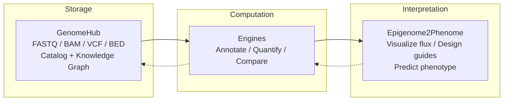

<p align="center">
  
  
  
  
</p>

# GenomeHub

Cloud-native genomic data management. Upload, catalog, and retrieve large sequencing files through a web UI. Files stream directly to S3 via presigned multipart URLs and never touch the application server.

GenomeHub is the data layer in a broader ecosystem for computational genomics:

| Project | Role |
|---|---|
| **GenomeHub** | Store and organize sequencing files (FASTQ, BAM, VCF, ...) |
| [SeqChain](https://github.com/ryandward/SeqChain) | Composable analysis toolkit for CRISPR design, Tn-seq, chromatin annotation |
| [Epigenome2Phenome](https://github.com/ryandward/ATACFlux) | Interactive visualization linking epigenomic state to metabolic flux |

---

## Architecture


The browser uploads directly to S3 via presigned multipart URLs. The server only coordinates metadata, so a 50 GB BAM file never touches the application server.

### Components

| Layer | Stack | Notes |
|---|---|---|
| Client | React 19, Vite, Tailwind CSS 4 | SPA with dashboard, file browser, upload, settings |
| Server | Express, TypeORM, AWS SDK v3 | REST API, presigned URL generation, metadata CRUD |
| Infra | AWS CDK (TypeScript) | Single `cdk deploy` provisions everything |
| Storage | S3 | Intelligent-Tiering at 30 days, Glacier at 180 days |
| Database | PostgreSQL 16 on RDS | Isolated subnet, encrypted at rest, 7-day backups |
| CDN | CloudFront | HTTPS termination; large downloads bypass via presigned S3 URLs |
| Auth | Google OAuth | Session tokens stored in the users table |

### Data model

All relationships are stored in a single `entity_edges` table that forms a knowledge graph. A file can belong to a collection, link to an organism, derive from another file, or reference an external URL. Adding a new relationship type never requires a schema change.

| Entity | Purpose |
|---|---|
| GenomicFile | Filename, S3 key, size, format, type tags, MD5, upload status |
| Collection | Named file groupings with type tags, technique and organism associations |
| Organism | Genus, species, strain (unique constraint), NCBI taxonomy ID |
| Technique | Sequencing assay types, seeded on boot (ChIP-seq, RNA-seq, ATAC-seq, ...) |
| Engine | External analysis services registered by URL, polled for health |
| FileType | User-managed file classification labels |
| RelationType | User-managed edge labels for provenance links |
| EntityEdge | Source, target, relation, metadata. The graph itself. |

### Engines

GenomeHub can connect to external analysis engines at runtime. An engine is any HTTP service that implements the engine contract (see [`docs/engine-methods-schema.json`](docs/engine-methods-schema.json)). Engines are stored in PostgreSQL and managed through the Settings page. Add a name and URL, and GenomeHub starts polling it immediately. No redeploy needed.

The sidebar shows a green status dot next to each reachable engine. Clicking an engine opens its method catalog, which GenomeHub renders dynamically from the schema — no hub-side configuration needed for new methods.

In production, engines typically run as sidecar containers in the same ECS Fargate task. They share the task's network namespace (reachable at `localhost`) and IAM role (automatic S3 access). The ALB only routes traffic to GenomeHub on port 3000. Engine containers are marked `essential: false`, so GenomeHub runs normally whether engines are healthy or not.

#### Engine contract

| Endpoint | Method | Description |
|---|---|---|
| `/api/health` | `GET` | Returns `{"status":"ok"}`. Polled every 30s for sidebar status. |
| `/api/methods` | `GET` | Returns the method catalog. GenomeHub renders the UI from this. |
| `/api/methods/:id` | `GET` | Single method descriptor (re-fetched before each dispatch). |
| `/api/files/upload` | `POST` | Accepts `multipart/form-data` with a `file` field. Returns `{"id":"..."}`. |
| `/api/methods/:id` | `POST` | Dispatch. Body is `{paramName: value}` JSON. Returns `200` (stream) or `202 {"job_id":"..."}`. |
| `/api/jobs/:id` | `GET` | Async only. Returns `{status, progress: {pct_complete, rate_per_sec, eta_seconds}, error}`. |
| `/api/jobs/:id/stream` | `GET` | Async only. Called once on `complete`. Body is the result file stream. |
| `/api/jobs/:id` | `DELETE` | Cancel request. Engine sets a cancellation flag; GenomeHub fire-and-forgets this. |

**Sync methods** (`async: false` or omitted) return the result stream directly in the `200` body with `Content-Disposition: attachment; filename="result.ext"`. GenomeHub pipes it to S3 with zero heap materialization.

**Async methods** (`async: true`) return `202 {"job_id":"..."}` immediately. GenomeHub polls `GET /api/jobs/:id` every 2 seconds. Progress fields drive the live UI: `pct_complete` (0.0–1.0, or `null` for indeterminate) triggers a spinner or progress bar. On `complete`, GenomeHub fetches the stream and pipes it to S3.

### Chip coloring

Metadata tags (file types, organisms, sequencing techniques) are rendered as colored chips. Each chip's color is derived deterministically from its label text using a polynomial string hash followed by a Knuth multiplicative scramble. The scramble maps small hash differences to large hue offsets, so visually similar labels like `gtf` and `gbff` get reliably distinct colors. No color palette, no database column, zero bytes of color data shipped.

---

## Quick start

### Prerequisites

- Node.js 22+
- Docker (local PostgreSQL)
- AWS CLI with configured credentials
- AWS CDK (`npm i -g aws-cdk`)

### Local development

```bash
docker compose up -d          # PostgreSQL on :5432
npm install                   # Install all workspaces
cp .env.example .env          # Configure AWS credentials + bucket
npm run dev                   # Client (:5173) + Server (:3000)
```

To connect a local analysis engine, start it separately, then go to Settings and add it with its URL (for example, SeqChain at `http://localhost:8001`). The sidebar will show a green dot when it connects.

### Deploy to AWS

```bash
npx cdk deploy --region us-west-2
```

Builds the Docker images, pushes to ECR, and provisions:

| Resource | Spec |
|---|---|
| VPC | 2 AZs, public / private / isolated subnets, 1 NAT gateway |
| S3 | `genome-hub-files-{account}-{region}`, all public access blocked |
| RDS | `db.t4g.small`, isolated subnet, encrypted, deletion protection |
| ECS Fargate | 1 vCPU / 2 GB, auto-scales to 4 tasks at 70% CPU |
| Containers | GenomeHub (port 3000, essential) + engine sidecars (optional) |
| CloudFront | HTTPS redirect, cache disabled for API pass-through |
| ALB | Public, health-checked, routes to GenomeHub only |

---

## Project structure

```
packages/
  client/            React SPA (Vite)
    src/
      pages/         Dashboard, Files, Upload, Organisms, Collections, Settings
      hooks/         TanStack Query data-fetching hooks
      ui/            CVA component recipes (Button, Badge, Card, Input, ...)
      lib/           API fetch wrapper, query keys, format detection
      components/    FilePreview, Breadcrumbs, EnginePanel, ...
      stores/        Zustand stores (app state, upload progress)
  server/            Express API
    src/
      entities/      TypeORM models (GenomicFile, Collection, Organism, Engine, ...)
      routes/        Route modules (files, engines, uploads, collections, ...)
      lib/           S3 helpers (putObject, putObjectStream), edge service
      migrations/    Sequential SQL schema migrations
  infra/             AWS CDK stack
concertina/          Vendored UI library (dist only — source at github.com/ryandward/concertina)
docs/
  engine-methods-schema.json   JSON Schema for the engine method catalog contract
```

## API reference

### Auth

| Method | Endpoint | Description |
|---|---|---|
| `POST` | `/api/auth/google` | Exchange Google OAuth token for session |
| `POST` | `/api/auth/logout` | Invalidate session |
| `GET` | `/api/auth/me` | Current user profile |

### Files

| Method | Endpoint | Description |
|---|---|---|
| `GET` | `/api/files` | List files with organism, collection, and type filters |
| `GET` | `/api/files/:id` | File detail with provenance, organisms, collections |
| `PUT` | `/api/files/:id` | Update file metadata (description, types, tags) |
| `DELETE` | `/api/files/:id` | Delete file from S3 and database |
| `GET` | `/api/files/:id/download` | Get a presigned download URL |

### Collections

| Method | Endpoint | Description |
|---|---|---|
| `GET` | `/api/collections` | List collections with file counts |
| `POST` | `/api/collections` | Create a collection |
| `GET` | `/api/collections/:id` | Collection detail with files |
| `PUT` | `/api/collections/:id` | Update collection metadata |
| `DELETE` | `/api/collections/:id` | Delete collection |

### Multipart uploads

| Method | Endpoint | Description |
|---|---|---|
| `POST` | `/api/uploads/initiate` | Register metadata and start S3 multipart |
| `POST` | `/api/uploads/part-url` | Get presigned URL for a single part |
| `POST` | `/api/uploads/complete` | Finalize multipart, verify object, mark ready |
| `POST` | `/api/uploads/abort` | Abort failed upload, mark file as error |

### Engines

| Method | Endpoint | Description |
|---|---|---|
| `GET` | `/api/engines` | List all engines with live health status (`ok`, `error`, `unavailable`) |
| `POST` | `/api/engines` | Register an engine (`{ name, url }`) |
| `PUT` | `/api/engines/:id` | Update engine name or URL |
| `DELETE` | `/api/engines/:id` | Remove an engine |
| `GET` | `/api/engines/:id/methods` | Proxy method catalog from the engine |
| `POST` | `/api/engines/:id/methods/:methodId` | Dispatch: stream inputs to engine, pipe result to S3, create provenance edges. Returns `{ fileId, filename }` (sync) or `{ jobId }` (async). |
| `GET` | `/api/engines/jobs/:jobId` | Poll async job status and progress |
| `DELETE` | `/api/engines/jobs/:jobId` | Cancel an async job |

### Reference data

Organisms, techniques, file types, and relation types all follow the same CRUD pattern:

| Method | Pattern | Description |
|---|---|---|
| `GET` | `/api/{resource}` | List all |
| `POST` | `/api/{resource}` | Create (`{ name, description? }`) |
| `PUT` | `/api/{resource}/:id` | Update |
| `DELETE` | `/api/{resource}/:id` | Delete (blocked if referenced by edges) |

Resources: `/api/organisms`, `/api/techniques`, `/api/file-types`, `/api/relation-types`

### Other

| Method | Endpoint | Description |
|---|---|---|
| `GET` | `/api/stats` | Storage stats grouped by format |
| `POST` | `/api/edges` | Create a knowledge graph edge |
| `DELETE` | `/api/edges/:id` | Remove an edge |
| `GET` | `/api/links/:parentType/:parentId` | External links for an entity |

### Supported formats

Any text file. Format is detected from the extension (`.gz` stripped automatically). The preview endpoint reads the first 8 KB and checks for null bytes — binary files return `previewable: false`, everything else gets infinite-scroll line preview.

---

## Streaming Architecture

### Zero-buffer data pipes

GenomeHub is a pipe. Files stream S3 → engine and engine → S3 without accumulating in Node heap.

### S3 → Engine (dispatch)

When a user dispatches a genomic analysis method, the server must forward a file from S3 to the engine without buffering the entire file in RAM. The implementation in `packages/server/src/routes/engines.ts` does this via the Web Streams API:

```
S3 object (e.g. 50 GB BAM)
  │
  └─ s3.send(GetObjectCommand)
       Body.transformToWebStream()   ← Web ReadableStream, backed by HTTP response body
         │
         ▼
  new ReadableStream({
    async start(controller) {
      controller.enqueue(prelude)     ← multipart headers (~200 bytes, TextEncoder)
      for await chunk of s3Body:
        controller.enqueue(chunk)     ← S3 SDK chunk, ~16-64 KB each
      controller.enqueue(epilogue)    ← multipart boundary (~30 bytes)
      controller.close()
    }
  })
         │
         ▼
  fetch(engineUrl, {
    method: "POST",
    headers: { "Content-Type": "multipart/form-data; boundary=..." },
    body: multipartStream,
    duplex: "half",                  ← streaming request body (Node.js 18+)
  })
```

**Server heap usage: O(one S3 chunk) ≈ 16–64 KB, regardless of file size.**

No `Buffer`, no `Blob`, no `FormData`, no `Content-Length`. Chunked transfer encoding is used automatically by Node.js's `fetch` implementation when the request body is a `ReadableStream`. The engine receives a valid `multipart/form-data` POST.

### Engine → S3 (result ingestion)

```
Engine result (sync 200 body, or async GET /api/jobs/:id/stream)
  │
  └─ response.body                ← Web ReadableStream
       Readable.fromWeb(...)      ← Node.js Readable, zero-copy conversion
         │
         ▼
  @aws-sdk/lib-storage Upload     ← streaming multipart upload, auto part sizing
    Bucket: genome-hub-files-...
    Key:    files/{uuid}/{filename}
    ServerSideEncryption: AES256
         │
         ▼
  fileRepo.create({ ... })        ← GenomicFile record (format from extension)
  edges.link(result → inputs, "derived_from")
```

**Server heap usage: O(upload part size) ≈ 5–10 MB, regardless of result size.**

The result file is never materialized in Node memory. `Content-Disposition: attachment; filename="result.ext"` on the engine response determines the stored filename and format.

### Core Stability Engine integration

The Files page virtualizes genomic file metadata using the Core Stability Engine (`concertina/core`). All data processing runs in a dedicated Web Worker; the main thread only handles DOM updates for the ~15–20 visible rows.

```
TanStack Query (main thread)
  │  GenomicFile[]
  ▼
useGenomicFileStream
  │  Converts to columnar batches via createRecordBatchStream
  │  Encodes organisms/collections as parallel list_utf8 columns
  │  (organism_ids[], organism_names[]) — no JSON.stringify
  │
  ▼  ArrayBuffer (transferred, zero-copy)
DataWorker (off-thread)
  │  Columnar storage: NumericColumn, Utf8Column, ListUtf8Column
  │  Schema integrity check: all columns must have identical row counts
  │  INGEST_ACK → main thread (one batch in flight at a time)
  │
  ▼  WINDOW_UPDATE (transferred ArrayBuffer, only visible rows)
VirtualChamber (main thread)
  │  buildAccessors(): parses window buffer once per scroll position
  │  RowProxy.get("organism_ids") → string[]   ← no JSON.parse
  │  RowProxy.get("organism_names") → string[]
  │  O(k) zip → { id, displayName }[] for ChipEditor
  │
  ▼  ~15–20 pool nodes recycled by CSS transform
```

**list_utf8 wire format** (used for `types`, `organism_ids`, `organism_names`, `collection_ids`, `collection_names`):

```
[4]                  u32    totalItems
[(rowCount+1) × 4]   Uint32 rowOffsets   row i → items[rowOffsets[i]..rowOffsets[i+1])
[(totalItems+1) × 4] Uint32 itemOffsets  item j → bytes[itemOffsets[j]..itemOffsets[j+1])
[Σ byte lengths]     Uint8  bytes        UTF-8 string data
```

`RowProxy.get()` returns `string[]` directly — the DataWorker decodes all UTF-8 before transferring the window buffer. No `JSON.parse` runs on the main thread during rendering.

**INGEST_ACK backpressure** prevents the IPC channel from being flooded: the main thread sends exactly one 500-row batch, then awaits `INGEST_ACK` from the worker before sending the next. For 1M rows (2000 batches × ~150 KB), the IPC queue depth is always 1, never 300 MB.

---

## Roadmap

### GenomeHub

- [ ] Search and filtering: full-text search over filenames, tags, and descriptions
- [ ] Batch operations: multi-file download (zip) and bulk tag editing
- [ ] File validation: post-upload format verification (samtools quickcheck, vcf-validator)
- [ ] Cost dashboard: real-time S3 storage cost estimates by storage tier

### Engine integration

- [x] Analysis triggers: schema-driven method UI, file picker with format filtering, dispatch
- [x] Result ingestion: engine outputs streamed to S3, cataloged with provenance edges
- [x] Async jobs: 202 dispatch path with live progress bar, ETA, rate, and cancel
- [x] Method catalog: engines declare methods via JSON schema, GenomeHub renders UI dynamically
- [ ] Preset library: save and re-apply parameter sets for common workflows

### End-to-end vision



---

## CDK commands

```bash
npx cdk diff       # Preview infrastructure changes
npx cdk synth      # Emit CloudFormation template
npx cdk destroy    # Tear down (S3 and RDS are retained by policy)
```
